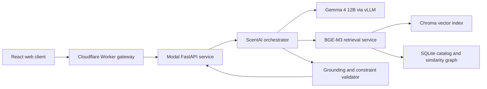

# ScentAI

ScentAI is an experimental, grounded perfume consultant built around a 131,930-item perfume catalog. It combines semantic retrieval, structured filtering, canonical entity resolution, a fine-tuned Gemma 4 adapter, and answer validation to produce recommendations that remain tied to catalog evidence.

This repository is a research preview. The end-to-end system works, the public deployment architecture is implemented, and the functional evaluation suite passes. Visual design and product ergonomics are still evolving.

## What It Does

- Understands free-form English and Turkish perfume questions.
- Recommends by mood, occasion, season, notes, accords, gender, and wear context.
- Enforces negative constraints before generation.
- Resolves abbreviated or ambiguous perfume names to canonical catalog records.
- Handles profiles, comparisons, similarity searches, and multi-turn requests for new options.
- Refuses unsupported live-price, availability, medical, and social-outcome claims.
- Validates generated perfume names and facts against the retrieved context.

## Architecture



The base model performs semantic planning and writes the first answer. The ScentAI LoRA is retained as a repair model when validation rejects the first generation. Deterministic code is limited to evidence checks, hard exclusions, exact field copying, identity resolution, and output safety.

Read [the architecture notes](docs/architecture.md) for the full request path.

## Repository Layout

```text
apps/web/           React client and Cloudflare API gateway
src/scentai/        Canonical orchestration and retrieval runtime
research/           L1-L5 data generation, evaluation, and runtime experiments
deploy/             Docker, Modal, FastAPI, and release infrastructure
notebooks/          Curated Colab workflows for training and inference
evaluation/         Frozen 120-case evaluation set and compact reports
tests/              Artifact-free unit and contract tests
docs/               Architecture, methodology, artifacts, and roadmap
```

## Evaluation Snapshot

The frozen V4 suite contains 120 English and Turkish cases across nine behavior families.

| Metric | Result |
| --- | ---: |
| Functional pass rate | 120 / 120 |
| Hard-filter pass rate | 100% |
| Entity-resolution pass rate | 100% |
| Language pass rate | 100% |
| Conversation no-repeat pass rate | 100% |
| Performance-calibration pass rate | 100% |
| First-attempt generation rate | 90.91% |
| Warm evaluation latency, p50 | 9.43 s |
| Warm evaluation latency, p95 | 14.29 s |

The fallback rate was 6.67%, slightly above the original 5% target, even though every fallback remained functionally valid. See [Evaluation](docs/evaluation.md) for the non-marketing version of the results and their limitations.

## Local Verification

The default test suite does not download the model, catalog, or vector database.

```bash
python -m venv .venv
source .venv/bin/activate
python -m pip install -r deploy/requirements-api.txt -r deploy/requirements-test.txt
python -m pip install -e .
make test-python

cd apps/web
npm ci
npm run check
```

Tests that require the external SQLite catalog are skipped when that artifact is absent. The unit suite uses temporary adapters and in-memory fixtures instead of committing model weights.

## Running The Full System

The complete runtime requires three external artifacts:

1. the ScentAI Gemma 4 LoRA adapter;
2. the BGE-M3 Chroma index;
3. the SQLite perfume catalog and similarity graph.

They are intentionally not committed to Git. See [Artifacts and data](docs/artifacts.md), [Modal deployment](deploy/release/modal.md), and the notebooks in [`notebooks/`](notebooks/) for the expected layout.

## Research Pipeline

The synthetic training curriculum separates five behavior levels:

| Level | Behavior |
| --- | --- |
| L1 | factual perfume knowledge |
| L2 | filtering, ranking, and comparison |
| L3 | semantic recommendation queries |
| L4 | grounded recommendations with reasoning |
| L5 | profile-aware and multi-turn personalization |

The main training plan contains 32,000 examples. Generation code, quality gates, provider pooling, checkpointing, and dataset validators live under [`research/`](research/). Large generated datasets are excluded pending a separate distribution and licensing review.

## Deployment

- **Model:** Gemma 4 12B BF16 with dynamic rank-16 LoRA on vLLM.
- **GPU:** scale-to-zero Modal A100 80 GB worker.
- **Retrieval:** one CPU BGE-M3, Chroma, and SQLite service.
- **API:** FastAPI with API-key protection and bounded in-memory sessions.
- **Web:** React served by Cloudflare Workers through a same-origin gateway.

Cold starts can take several minutes because the model worker scales to zero. Warm request latency is substantially lower and should be evaluated separately from startup time.

## Data And Model Availability

This source repository does **not** contain:

- raw or cleaned perfume catalog exports;
- generated training datasets;
- LoRA checkpoints or base-model weights;
- Chroma or SQLite runtime snapshots;
- API keys, tokens, or deployment secrets.

The code can be reviewed and tested without those files. Reproducing the complete hosted system requires supplying compatible artifacts as documented in [Artifacts and data](docs/artifacts.md).

## Project Status

ScentAI is a working experimental system, not a finished commercial service. Current priorities are documented in the [roadmap](docs/roadmap.md). The frontend included here is functional, but its final visual language is still in progress.

No open-source license has been selected yet. Source availability should not be interpreted as permission to redistribute the datasets, model weights, or third-party material.

# ScentAI
