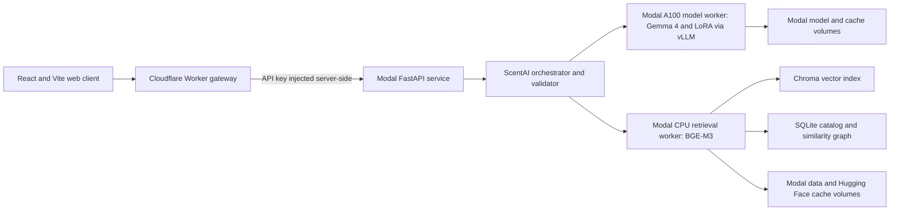

# ScentAI

ScentAI is an experimental, grounded perfume consultant built around a 131,930-item perfume catalog. It combines semantic retrieval, structured filtering, canonical entity resolution, a fine-tuned Gemma 4 adapter, and answer validation to produce recommendations that remain tied to catalog evidence.

This repository is a research preview. The end-to-end system works, the public deployment architecture is implemented, and the functional evaluation suite passes. Visual design and product ergonomics are still evolving.

## What It Does

- Understands free-form English and Turkish perfume questions.
- Recommends by mood, occasion, season, notes, accords, gender, and wear context.
- Enforces negative constraints before generation.
- Resolves abbreviated or ambiguous perfume names to canonical catalog records.
- Handles profiles, comparisons, similarity searches, and multi-turn requests for new options.
- Refuses unsupported live-price, availability, medical, and social-outcome claims.
- Validates generated perfume names and facts against the retrieved context.

## Technology Stack

| Layer | Technology | Responsibility |
| --- | --- | --- |
| Web application | React 19, TypeScript, Vite | Conversation UI, warm-up state, anonymous session persistence |
| Public edge | Cloudflare Workers and Workers Assets | Static hosting, same-origin API gateway, secret injection, request validation, rate limiting, security headers |
| Application API | FastAPI and Pydantic on Modal | Asynchronous chat/warm-up jobs, session lifecycle, orchestration, response contracts |
| Model serving | Gemma 4 12B, ScentAI LoRA, vLLM | Planning, consultant-style generation, validation-triggered LoRA repair |
| GPU compute | Modal A100 80 GB | Scale-to-zero model worker with cached model and vLLM artifacts |
| Retrieval | BGE-M3, Chroma, SQLite | Semantic search, structured perfume metadata, canonical identity, similarity graph |
| Packaging | Docker Compose and Modal Images | Reproducible local/self-hosted services and cloud deployment |
| Quality | Pytest, Vitest, frozen evaluation contracts | Unit, API, retrieval, frontend, grounding, and behavioral regression checks |

## Architecture



The base model performs semantic planning and writes the first answer. The ScentAI LoRA is retained as a repair model when validation rejects the first generation. Deterministic code is limited to evidence checks, hard exclusions, exact field copying, identity resolution, and output safety.

The public browser talks only to Cloudflare. The Worker keeps `SCENTAI_API_KEY` out of the client,
sanitizes the exposed route set, and proxies accepted requests to the Modal endpoint. Modal keeps the
FastAPI, GPU model, and CPU retrieval processes independently deployable and independently scalable.

Read [the architecture notes](docs/architecture.md) for service boundaries, cold-start behavior,
security decisions, and the full request path. Operational setup is documented separately for
[Modal](deploy/release/modal.md) and [Cloudflare](deploy/release/cloudflare.md).

## Repository Layout

```text
apps/web/           React client and Cloudflare API gateway
src/scentai/        Canonical orchestration and retrieval runtime
research/           L1-L5 data generation, evaluation, and runtime experiments
deploy/             Docker, Modal, FastAPI, and release infrastructure
notebooks/          Curated Colab workflows for training and inference
evaluation/         Frozen 120-case evaluation set and compact reports
tests/              Artifact-free unit and contract tests
dataset/            Dataset card, attribution, license, sample, and Kaggle metadata
model/              Hugging Face model card and adapter license
docs/               Architecture, methodology, artifacts, and roadmap
tools/              Dataset audit and release packaging utilities
```

## Evaluation Snapshot

The frozen V4 suite contains 120 English and Turkish cases across nine behavior families.

| Metric | Result |
| --- | ---: |
| Functional pass rate | 120 / 120 |
| Hard-filter pass rate | 100% |
| Entity-resolution pass rate | 100% |
| Language pass rate | 100% |
| Conversation no-repeat pass rate | 100% |
| Performance-calibration pass rate | 100% |
| First-attempt generation rate | 90.91% |
| Warm evaluation latency, p50 | 9.43 s |
| Warm evaluation latency, p95 | 14.29 s |

The fallback rate was 6.67%, slightly above the original 5% target, even though every fallback remained functionally valid. See [Evaluation](docs/evaluation.md) for the non-marketing version of the results and their limitations.

## Local Verification

The default test suite does not download the model, catalog, or vector database.

```bash
python -m venv .venv
source .venv/bin/activate
python -m pip install -r deploy/requirements-api.txt -r deploy/requirements-test.txt
python -m pip install -e .
make test-python

cd apps/web
npm ci
npm run check
```

Tests that require the external SQLite catalog are skipped when that artifact is absent. The unit suite uses temporary adapters and in-memory fixtures instead of committing model weights.

## Running The Full System

The complete runtime requires three external artifacts:

1. the ScentAI Gemma 4 LoRA adapter;
2. the BGE-M3 Chroma index;
3. the SQLite perfume catalog and similarity graph.

They are intentionally not committed to Git. See [Artifacts and data](docs/artifacts.md), [Modal deployment](deploy/release/modal.md), and the notebooks in [`notebooks/`](notebooks/) for the expected layout.

## Research Pipeline

The synthetic training curriculum separates five behavior levels:

| Level | Behavior |
| --- | --- |
| L1 | factual perfume knowledge |
| L2 | filtering, ranking, and comparison |
| L3 | semantic recommendation queries |
| L4 | grounded recommendations with reasoning |
| L5 | profile-aware and multi-turn personalization |

The main training plan contains 32,000 examples. Generation code, quality gates, provider pooling, checkpointing, and dataset validators live under [`research/`](research/). The generated corpus is documented separately from the source code and published on Kaggle under its inherited data license.

## Dataset

**ScentAI 32K Grounded Perfume Conversations** is the instruction-tuning corpus used by this
project. It contains 32,000 synthetic, three-message conversations across the L1-L5 curriculum,
plus a reproducible 30,400/1,600 train-validation split.

**[Download ScentAI 32K on Kaggle](https://www.kaggle.com/datasets/sefasoysal/scentai-32k-grounded-perfume-conversations)**

The perfume evidence derives from [Fragrantica Perfumes: Ratings, Notes, Votes & More](https://www.kaggle.com/datasets/ledecanteur/fragrantica-perfumes),
published by Le Decanteur on Kaggle. The derived conversation dataset is therefore released under
`CC BY-NC-SA 4.0`: attribution is required, commercial use is prohibited, and adaptations must use
the same license. ScentAI is independent and is not affiliated with Fragrantica or Le Decanteur.

The large JSONL exports remain outside Git. See the [dataset card](dataset/README.md),
[attribution notice](dataset/ATTRIBUTION.md), [corpus statistics](dataset/statistics.json), and
[`build_kaggle_package.py`](tools/build_kaggle_package.py) for the exact package and provenance.

## Deployment

- **Cloudflare:** serves the React build and runs the public gateway. Separate rate limiters protect
  chat creation, warm-up creation, and polling; the Modal credential exists only as a Worker secret.
- **Modal API:** a public FastAPI ASGI function exposes asynchronous warm-up, chat, polling, and
  session-deletion contracts. It coordinates private workers without exposing them directly.
- **Modal model worker:** runs Gemma 4 12B in BF16 on an A100 80 GB through vLLM 0.25.1. The rank-16
  adapter is loaded dynamically and the worker scales to zero when idle.
- **Modal retrieval worker:** runs BGE-M3 on CPU against persistent Chroma and SQLite artifacts.
- **Modal Volumes:** retain the LoRA, catalog, vector index, Hugging Face snapshot, and vLLM cache
  across ephemeral containers.
- **Docker Compose:** mirrors the model/retrieval/API separation for a reserved GPU host or local
  infrastructure testing.

Cold starts can take several minutes because the model worker scales to zero. Warm request latency is substantially lower and should be evaluated separately from startup time.

## Data And Model Availability

This source repository does **not** contain:

- raw or cleaned perfume catalog exports;
- large generated training exports ([download them from Kaggle](https://www.kaggle.com/datasets/sefasoysal/scentai-32k-grounded-perfume-conversations));
- LoRA checkpoints or base-model weights;
- Chroma or SQLite runtime snapshots;
- API keys, tokens, or deployment secrets.

The code can be reviewed and tested without those files. A small schema-valid example and complete
dataset documentation are kept under [`dataset/`](dataset/). Reproducing the complete hosted system
still requires compatible runtime artifacts as documented in [Artifacts and data](docs/artifacts.md).

The Hugging Face-ready adapter card and loading example live under [`model/`](model/). The final
adapter can be published directly from the private Modal Volume with
[`modal_publish_hf.py`](deploy/modal_publish_hf.py), avoiding a local round trip for the weights.

## Project Status

ScentAI is a working experimental system, not a finished commercial service. Current priorities are documented in the [roadmap](docs/roadmap.md). The frontend included here is functional, but its final visual language is still in progress.

No open-source license has been selected yet. Source availability should not be interpreted as permission to redistribute the datasets, model weights, or third-party material.

# ScentAI
