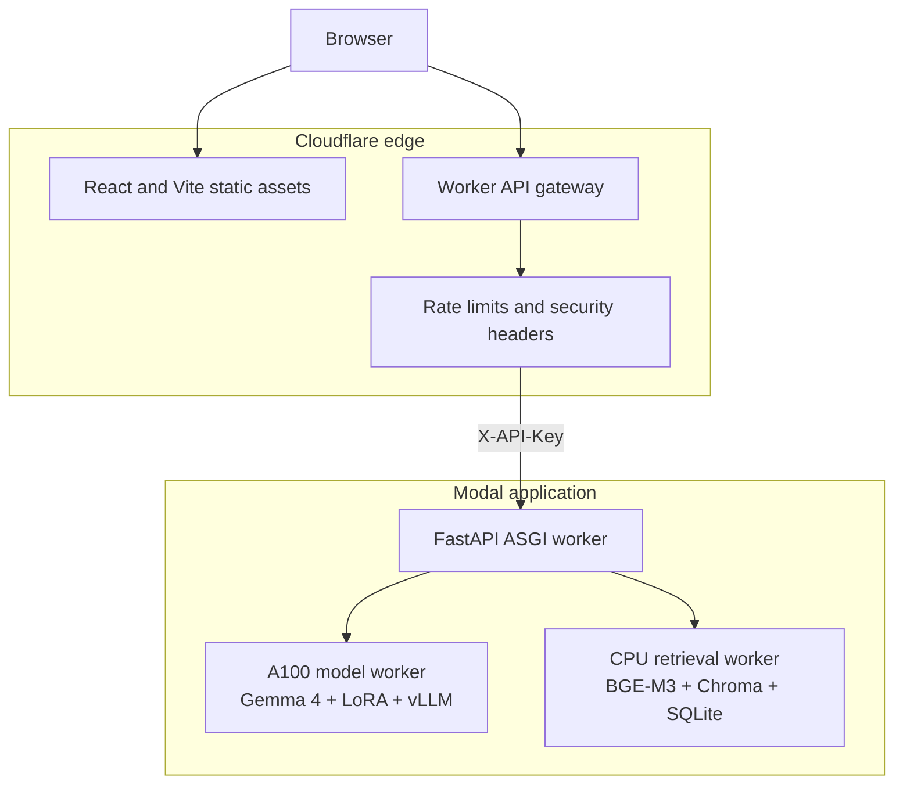

# Architecture

## Infrastructure Overview

ScentAI is deployed as an edge application in front of three isolated Modal services. The split is
both operational and technical: the CUDA/vLLM dependency graph never shares a container with
BGE-M3/Chroma, while the public API remains lightweight and independently replaceable.

| Boundary | Runtime | Current allocation | Purpose |
| --- | --- | --- | --- |
| Web and gateway | Cloudflare Workers + Workers Assets | Global edge | Serve React, validate public requests, inject the upstream secret, enforce rate limits |
| API | FastAPI on Modal | 2 vCPU, 2 GB, up to one container | Session state, async jobs, orchestration, response validation |
| Model | vLLM on Modal | A100 80 GB, up to one container/input | Serve Gemma 4 12B BF16 and the dynamic ScentAI LoRA |
| Retrieval | Python worker on Modal | 4 vCPU, 16 GB, up to one container/input | BGE-M3 search, Chroma access, SQLite metadata and graph queries |

Persistent Modal Volumes hold the LoRA, Chroma snapshot, SQLite catalog, Hugging Face model cache,
and vLLM cache. Containers remain disposable; artifacts do not need to be uploaded at every boot.



The model and retrieval workers are private Modal class methods. Only the FastAPI ASGI function is
reachable from Cloudflare, and only Cloudflare stores the upstream API key used by the public web
client.

## Request Lifecycle

1. The client starts an asynchronous warm-up job before opening the composer.
2. A model-based planner converts the free-form request into an evidence-bearing JSON plan.
3. Planner constraints are checked against the exact user text.
4. Retrieval resolves named perfumes or performs BGE-M3 semantic search.
5. SQLite metadata, community similarity edges, ratings, popularity, and hard filters rerank the candidate pool.
6. Grounded perfume cards are sent to Gemma 4.
7. The answer validator checks catalog identity, unsupported facts, requested counts, hard exclusions, language, and performance calibration.
8. Invalid answers receive one repair attempt through the LoRA. A deterministic grounded fallback is used only when both generations fail validation.

## Runtime Boundaries

The system keeps three environments separate:

- **Model worker:** vLLM, CUDA, Gemma 4, and the dynamic LoRA.
- **Retrieval worker:** CPU PyTorch, BGE-M3, Chroma, and SQLite.
- **API worker:** orchestration, sessions, validation, and asynchronous jobs.

This separation was introduced after combined notebook environments repeatedly produced incompatible CUDA, Transformers, Pillow, torchvision, and vLLM dependency graphs.

## Cloudflare Boundary

The Cloudflare Worker serves the built React application and handles `/api/scentai/*` before static
asset resolution. It intentionally exposes only chat creation, warm-up creation, job polling, and
session deletion. At this boundary it also:

- validates JSON content type, body size, query length, and identifier shape;
- rejects cross-origin writes;
- applies independent per-client limits to chat, warm-up, and polling traffic;
- injects `SCENTAI_API_KEY` without making it available to browser JavaScript;
- adds CSP, HSTS, clickjacking, MIME-sniffing, permissions, and referrer-policy headers;
- converts upstream connection failures into a stable `502` response contract.

The frontend starts a warm-up job before enabling conversation. This turns a multi-minute GPU cold
start into an explicit loading state rather than leaving the first chat request apparently frozen.

## Modal Boundary

Modal hosts three roles from [`deploy/modal_app.py`](../deploy/modal_app.py):

1. `web` is the public FastAPI ASGI function. It owns bounded in-memory sessions and asynchronous
   job contracts, with a maximum of four concurrent inputs.
2. `ModelWorker` launches the pinned vLLM image on an A100 80 GB. It serves the base model and LoRA
   through an OpenAI-compatible local endpoint and accepts one request at a time.
3. `RetrievalWorker` keeps one BGE-M3 engine alive on a dedicated CPU worker thread. Chroma and
   SQLite remain local to that process rather than being repeatedly reopened by API requests.

All three roles scale down when idle. The model worker has the shortest expensive lifecycle; the
API and retrieval workers remain warm longer to reduce repeated initialization. Model snapshots and
runtime caches live on persistent volumes, so scale-to-zero removes compute cost rather than state.

## Retrieval

Retrieval starts with a broad semantic pool and then applies structured scoring. Important signals include:

- semantic similarity;
- required and preferred traits;
- hard negative filters;
- confidence-adjusted rating and vote count;
- mainstream or niche discovery mode;
- brand diversity;
- canonical name confidence;
- community similarity votes for reference-fragrance queries.

Product-name matching is catalog-wide. It does not contain a one-off alias for a single perfume family. Exact names, shortened family names, brand-qualified names, and common abbreviations are resolved through normalized catalog evidence and dominance signals.

## Generation Policy

The model is responsible for semantic understanding and consultant-style prose. Code remains deterministic where a language model should not be trusted:

- copying exact database fields;
- applying explicit exclusions;
- verifying named products;
- enforcing counts;
- rejecting unsupported live or medical claims;
- preventing fabricated catalog facts.

The production release uses the base model for planning and first-answer generation. The fine-tuned adapter is a validation-triggered repair model. This configuration performed better than forcing every request through the adapter.

## Deployment Path

```text
Browser
  -> Cloudflare Worker and static assets
  -> Modal public FastAPI worker
  -> private Modal model worker
  -> private Modal retrieval worker
```

The browser never receives the Modal API key. Cloudflare injects it server-side and allowlists the asynchronous warm-up, chat, polling, and session-deletion routes.

## Alternative Docker Path

[`deploy/compose.yaml`](../deploy/compose.yaml) preserves the same three-service boundary for a
reserved GPU server: only FastAPI publishes a host port, while vLLM and retrieval stay on the
internal Compose network. This target is useful for self-hosting and integration testing; Modal is
the selected on-demand deployment because the experimental service does not need a continuously
reserved A100.

## Operational Trade-offs

- **Cold start:** scale-to-zero keeps experimental costs low but a fully cold A100 worker can take
  several minutes to load. The UI exposes this as a warm-up phase.
- **Concurrency:** model and retrieval concurrency are deliberately conservative. This protects
  GPU memory and avoids thread-affinity problems, but it is not a high-throughput production setup.
- **Session state:** sessions are currently bounded and in memory. Multiple API replicas would
  require a shared store such as Redis before horizontal scaling.
- **GPU memory:** vLLM uses a `0.65` memory-utilization target. This lowers KV-cache capacity rather
  than changing model weights or answer quality.
- **Portability:** Docker Compose is retained so the application is not structurally locked to
  Modal, even though the current public deployment uses Modal and Cloudflare.
